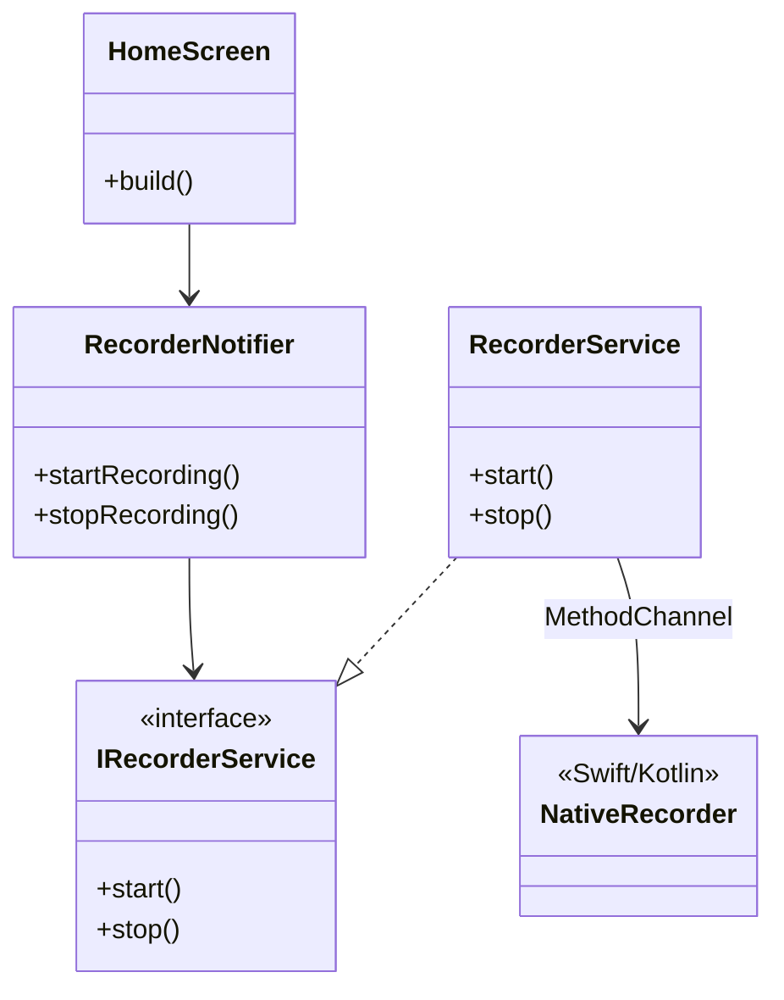

# Vozoo Architecture

Vozoo is built using a Layered Architecture with Flutter Riverpod for state management and Dependency Injection.

## Layers

### 1. Presentation (`lib/presentation`)
- **Responsibility**: UI rendering and handling user interactions.
- **State Management**: Uses `ConsumerWidget` and `ConsumerStatefulWidget` to listen to Riverpod providers.
- **Screens**:
  - `HomeScreen`: Recording control.
  - `EffectSelectScreen`: Choosing voice effects.
  - `ResultScreen`: Playback, Save, Share.

### 2. Application (`lib/application`)
- **Responsibility**: Orchestrates business logic, connects Presentation to Domain/Infrastructure.
- **Components**:
  - `UseCases` (implemented as `StateNotifier`s): `RecorderUseCase`, `ProcessorUseCase`, `PlayerUseCase`.
  - `Providers`: Define DI wiring.
- **State**: Defines immutable state classes (e.g., `RecorderState`) exposed to UI.

### 3. Domain (`lib/domain`)
- **Responsibility**: Defines core business entities and abstract interfaces.
- **Entities**: `RecordedAudio`, `VoicePreset`.
- **Interfaces**:
  - `IRecorderService`
  - `IAudioProcessorService`
  - `IAudioPlayerService`
  - `IShareService`
  - `IStorageService`

### 4. Infrastructure (`lib/infrastructure`)
- **Responsibility**: Concrete implementations of Domain interfaces.
- **Components**:
  - `RecorderService`: Uses MethodChannel to talk to Native iOS (AVAudioRecorder) and Android (AudioRecord).
  - `AudioProcessorService`: Uses FFI to call C++ DSP functions.
  - `AudioPlayerService`: Wraps `audioplayers` package.
  - `ShareService`: Wraps `share_plus`.
  - `StorageService`: Wraps `path_provider`.

## Native Modules

### C++ DSP Core (`packages/vozoo_dsp`)
- **Location**: `packages/vozoo_dsp/src/vozoo_dsp.cpp`
- **Responsibility**: Audio signal processing (Pitch shift, EQ, Effects).
- **Interface**: `process_file(input, output, preset_id)`
- **Build**: Built via CMake (Android) and Podspec/Xcode (iOS).

### iOS Native (`ios/Runner`)
- **RecorderService.swift**: Implements audio recording using `AVAudioRecorder`.
- **Exposed via**: MethodChannel `com.example.vozoo/recorder`.

### Android Native (`android/app`)
- **MainActivity.kt / RecorderService**: Implements audio recording using `AudioRecord`.
- **Exposed via**: MethodChannel `com.example.vozoo/recorder`.

## Class Diagram (Simplified)

