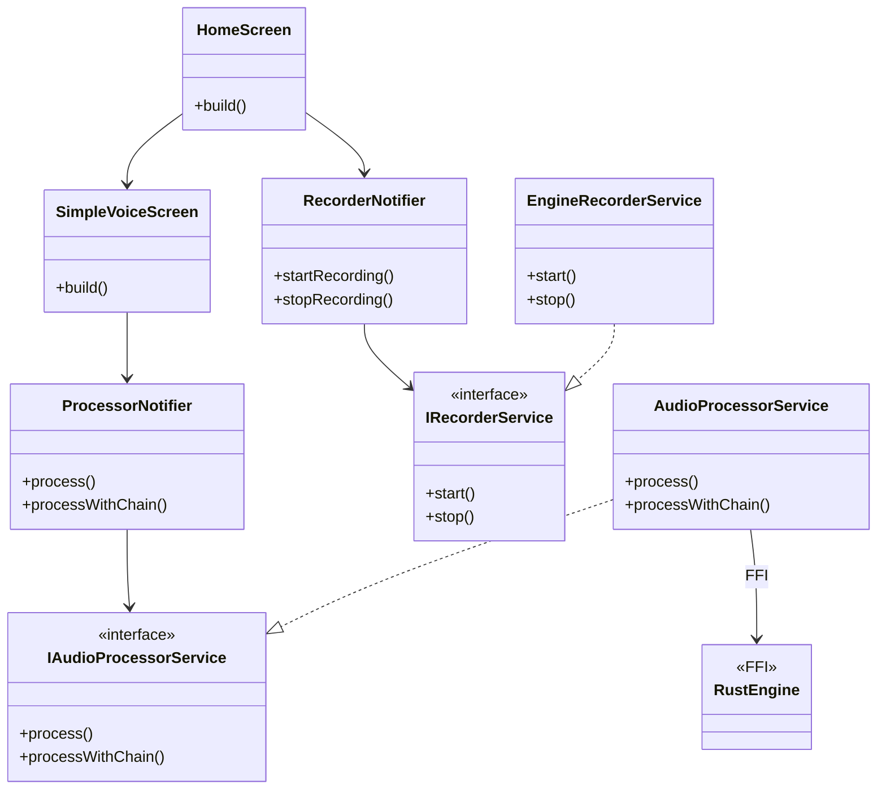

# Vozoo Architecture

Vozoo is built using a Layered Architecture with Flutter Riverpod for state management and Dependency Injection.

## Layers

### 1. Presentation (`lib/presentation`)
- **Responsibility**: UI rendering and handling user interactions.
- **State Management**: Uses `ConsumerWidget` and `ConsumerStatefulWidget` to listen to Riverpod providers.
- **Screens**:
  - `HomeScreen`: Recording control.
  - `SimpleVoiceScreen`: Main transformation flow with character presets and four custom sliders.
  - `ResultScreen`: Playback, Save, Share.

### 2. Application (`lib/application`)
- **Responsibility**: Orchestrates business logic, connects Presentation to Domain/Infrastructure.
- **Components**:
  - `UseCases` (implemented as `StateNotifier`s): `RecorderUseCase`, `ProcessorUseCase`, `PlayerUseCase`.
  - `Providers`: Define DI wiring.
- **State**: Defines immutable state classes (e.g., `RecorderState`) exposed to UI.

### 3. Domain (`lib/domain`)
- **Responsibility**: Defines core business entities and abstract interfaces.
- **Entities**: `RecordedAudio`, `VoicePreset`, `SimpleCharacter`, `CustomVoiceSettings`.
- **Interfaces**:
  - `IRecorderService`
  - `IAudioProcessorService`
  - `IAudioPlayerService`
  - `IShareService`
  - `IStorageService`

### 4. Infrastructure (`lib/infrastructure`)
- **Responsibility**: Concrete implementations of Domain interfaces.
- **Components**:
  - `EngineRecorderService`: Uses the shared real-time engine for capture.
  - `AudioProcessorService`: Uses FFI to call the Rust DSP engine.
  - `AudioPlayerService`: Wraps `audioplayers` package.
  - `ShareService`: Wraps `share_plus`.

## Native Modules

### Rust DSP Core (`packages/vozoo_engine`)
- **Location**: `packages/vozoo_engine/vozoo-nodes/`
- **Responsibility**: Audio signal processing (pitch, formant, modulation, reverb, spatial, dynamics).
- **Interface**:
  - `process_file(input, output, preset_id)`
  - `process_file_with_chain(input, output, chain_json)`
- **Build**: Exposed through `vozoo-ffi` and loaded from Flutter with `packages/vozoo_engine/lib/vozoo_engine.dart`.

### Shared Realtime Path
- `vozoo-io::RealtimeEngine`: drives monitor / record / process paths for native audio devices.
- `engineProvider` in Flutter exposes the shared engine to recording and live monitor UI.

## Class Diagram (Simplified)

